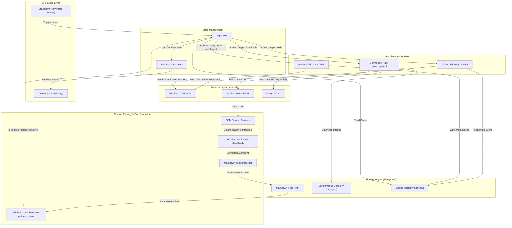
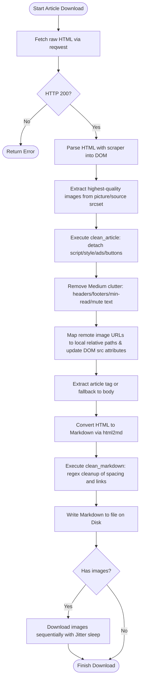

# System Architecture — med2md

`med2md` is an asynchronous Rust application that downloads Medium articles and converts them into clean, standalone Markdown files with locally saved images. It provides a Terminal User Interface (TUI) powered by `ratatui` and `crossterm`.

This document details the high-level architecture, component breakdown, and data flows of the system.

---

## 1. Core Architecture Diagram

The system is organized into decoupled layers: a **UI & State Layer** executing on the main thread, **Asynchronous Workers** communicating via message-passing channels, a **Parsing/Transformation Engine** that parses and cleans HTML DOM structures, a **Network Layer** that interacts with Medium APIs and RSS feeds, and a **Storage Engine** handling markdown outputs, media directories, and cached local assets.

---

## 2. Article Parsing and Cleaning Pipeline

Medium articles contain substantial amounts of tracking query parameters, navigation links, subscription banners, and interactive elements (like scripts, buttons, and mute options). `med2md` cleans these out in a structured pipeline before translating the HTML elements to Markdown format.

---

## 3. Component Breakdown

The codebase is modularized into discrete sub-modules under `src/` to separate TUI rendering, state control, network calls, HTML traversal, and disk persistence:

### A. State Management, UI & Event Handling
*   **[src/main.rs](src/main.rs)**: The application entry point. Parses command line arguments, initializes tracing instrumentation, sets up cookie authentication, and runs the terminal event loop.
*   **[src/app.rs](src/app.rs)**: Defines the central structures [App](src/app.rs#L60) (global application state), [AppView](src/app.rs#L30) (UI view variants: `Download`, `Picker`, `FeedSelector`, `AuthorBrowser`, `Loading`), and [AppEvent](src/app.rs#L51) (async channels communication event enumeration).
*   **[src/ui.rs](src/ui.rs)**: Renders TUI frames and subcomponents in [draw_ui](src/ui.rs#L78) using Ratatui layout splits, block borders, lists, and formatted paragraphs.
*   **[src/input.rs](src/input.rs)**: Listens for key events and triggers actions in [handle_key](src/input.rs#L277), cleans multi-line URL payloads via [handle_paste](src/input.rs#L128), and kicks off async download loops in [start_download](src/input.rs#L423).

### B. Network, Authentication & API Harvesting
*   **[src/auth.rs](src/auth.rs)**: Implements [setup_cookies](src/auth.rs#L38) to read tokens from environment variables or query users interactively using `rpassword`, validating session integrity against Medium endpoints.
*   **[src/following.rs](src/following.rs)**: Retrieves followed writers and publications lists in [fetch_following_list](src/following.rs#L426) and crawls creators' RSS feeds to compile feed checklist details in [fetch_following_feed](src/following.rs#L41).
*   **[src/articles.rs](src/articles.rs)**: Queries user-specific author articles utilizing Medium API pagination limits and fallback RSS scraping.
*   **[src/feed.rs](src/feed.rs)**: Strips XSSI security wrappers from JSON responses, parses Apollo GraphQL states, and parses XML RSS feeds.
*   **[src/net.rs](src/net.rs)**: Defines common reqwest headers and manages sequential article downloading in [perform_download](src/net.rs#L33).

### C. Processing, Formatting & Storage
*   **[src/html.rs](src/html.rs)**: Houses the parsing and DOM cleaning routines including [clean_article](src/html.rs#L70) (element extraction, detach nodes) and [clean_article_and_collect_images](src/html.rs#L253) (srcset extraction, relative target path rewriting).
*   **[src/markdown.rs](src/markdown.rs)**: Formats local markdown files for the preview pane using `tui-markdown` in [render_markdown](src/markdown.rs#L8).
*   **[src/cache.rs](src/cache.rs)**: Reads and writes JSON-serialized records of authors, RSS feed items, and author metadata to the local cache directory under `<output_dir>/.cache`.
*   **[src/meta.rs](src/meta.rs)**: Coordinates asynchronous background author enrichment via [enrich_authors](src/meta.rs#L83) to fetch the latest post timestamps and post counts for all creators.
*   **[src/util.rs](src/util.rs)**: Implements common date formatting, slug sanitization, and jitter wait calculation.

---

## 4. Key Architectural Choices

1.  **Asynchronous Background Concurrency**: Heavy-weight IO operations (such as scraping, RSS fetching, author enrichment, and HTTP downloading) are offloaded to tokio threads via `tokio::spawn`. This prevents blockages in TUI rendering or user key processing.
2.  **Sequential Downloads with Jitter**: To protect the user's IP address and session from security challenges and rate-limiting from Cloudflare/Medium, downloads are executed sequentially rather than in parallel, separated by jittered delay periods.
3.  **Apollo GraphQL Harvesting**: Instead of relying purely on unstable HTML scraping structures, `med2md` parses the JSON Apollo State initialized within script tags in Medium's homepage, enabling stable retrieval of followed author details.
4.  **Author Enrichment and Cache Synchronization**: The background enrichment worker (defined in [src/meta.rs](src/meta.rs)) queries each author's latest post RSS timestamp and total posts. It caches them locally (`.cache/`) to avoid heavy startup fetches, enabling instantaneous reloading.
5.  **Formatted Markdown Rendering**: Swapped raw text viewing in the file picker preview pane for a fully formatted rendered layout using `tui-markdown` to provide a premium viewing experience directly within the terminal interface.
