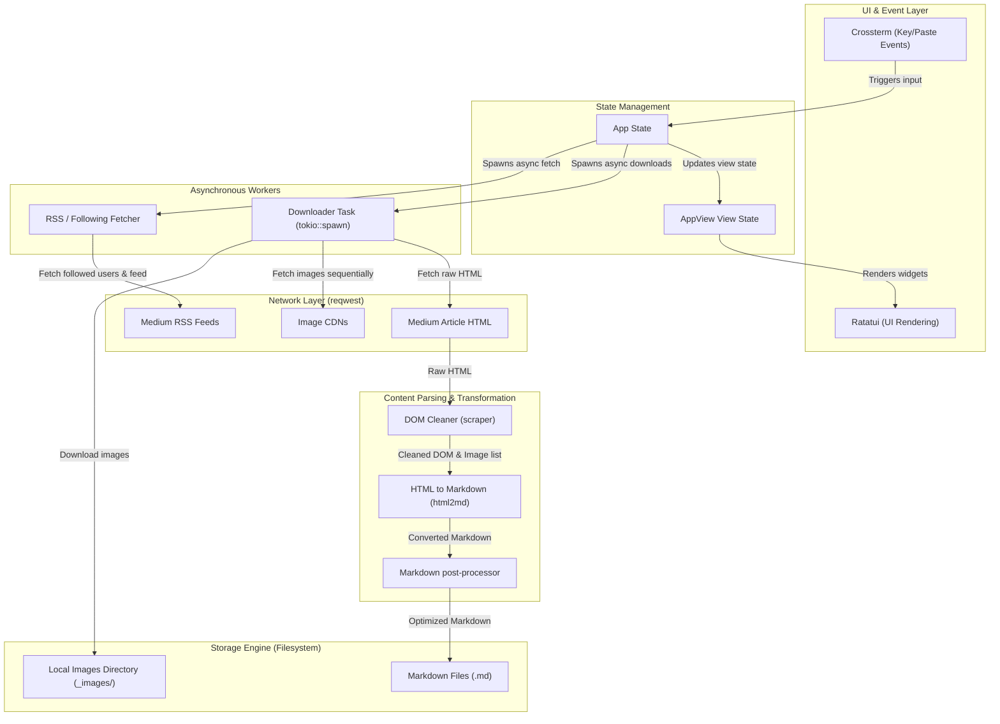

# System Architecture — med2md

`med2md` is an asynchronous Rust application that downloads Medium articles and converts them into clean, standalone Markdown files with locally saved images. It provides a Terminal User Interface (TUI) powered by `ratatui` and `crossterm`.

This document details the high-level architecture, component breakdown, and data flows of the system.

---

## 1. Core Architecture Diagram

The system is organized into decoupled layers: a **UI & State Layer** executing on the main thread, **Asynchronous Workers** communicating via message-passing channels, a **Parsing/Transformation Engine** that parses and cleans HTML DOM structures, and a **Network Layer** that interacts with Medium APIs and RSS feeds.

---

## 2. Article Parsing and Cleaning Pipeline

Medium articles contain substantial amounts of tracking query parameters, navigation links, subscription banners, and interactive elements (like scripts, buttons, and mute options). `med2md` cleans these out in a structured pipeline before translating the HTML elements to Markdown format.

---

## 3. Component Breakdown

All source code is housed in [src/main.rs](file:///home/mdfranz/github/med2md/src/main.rs). The logic is split into the following primary components:

### A. State Management & Runtime
*   **[App](file:///home/mdfranz/github/med2md/src/main.rs#L46)**: The central state container. It manages session cookies (`sid`, `uid`, `cf_clearance`), pasted download URLs, operational log entries, and feed items selected for retrieval.
*   **[AppView](file:///home/mdfranz/github/med2md/src/main.rs#L22)**: A state enum managing TUI layouts:
    *   `Download`: The main view containing URL paste inputs and real-time execution logs.
    *   `Picker`: A browser layout to list files in the output directory and preview their rendered Markdown layout.
    *   `FeedSelector`: A check-list selector to browse and choose articles to download from active feeds.
    *   `AuthorBrowser`: A list viewer allowing the user to select followed writers/publications.
    *   `Loading`: Displays a blocking loading spinner with custom notifications.
*   **[AppEvent](file:///home/mdfranz/github/med2md/src/main.rs#L40)**: Message definitions used to communicate between background async workers and the foreground TUI loop.

### B. User Interface & Event Processing
*   **[draw_ui](file:///home/mdfranz/github/med2md/src/main.rs#L1880)**: Directs the layout and rendering of TUI panels (using Ratatui layout splits, block borders, lists, and text paragraphs).
*   **[handle_key](file:///home/mdfranz/github/med2md/src/main.rs#L326)**: Dispatches keyboard events relative to the active `AppView` (e.g. text navigation, checkbox toggles, or view switching shortcuts like `Ctrl+P`).
*   **[handle_paste](file:///home/mdfranz/github/med2md/src/main.rs#L226)**: Processes raw system clipboard entries, filtering and splitting multi-line inputs into a series of downloadable URLs.

### C. Network & Authentication
*   **[setup_cookies](file:///home/mdfranz/github/med2md/src/main.rs#L2204)**: Reads credentials from environment variables (`MEDIUM_SID`, `MEDIUM_UID`, `MEDIUM_CF_CLEARANCE`) or prompts the user interactively (using `rpassword`) before executing the TUI. It makes a test HTTP handshake against Medium to verify validation.
*   **[fetch_following_list](file:///home/mdfranz/github/med2md/src/main.rs#L1530)**: Resolves followed accounts by hitting internal API endpoints or parsing Medium following pages.
*   **[fetch_following_feed](file:///home/mdfranz/github/med2md/src/main.rs#L1151)**: Obtains article suggestions by fetching feed endpoints, parsing their embedded Apollo GraphQL states, and crawling the RSS feeds of followed creators.

### D. Downloader & Cleaner Engine
*   **[start_download](file:///home/mdfranz/github/med2md/src/main.rs#L594)**: Spawns the background runtime task that iterates through download targets, updates logs, and signals when downloads conclude.
*   **[perform_download](file:///home/mdfranz/github/med2md/src/main.rs#L1699)**: orchestrates downloading an individual article's HTML, parsing the DOM, extracting assets, saving Markdown content, and fetching the image payloads.
*   **[clean_article_and_collect_images](file:///home/mdfranz/github/med2md/src/main.rs#L902)**: Parses `<picture>` components to capture full-size CDN links, detaches deprecated child elements, assigns relative local paths (`./[slug]_images/img_x.ext`), and rewrites matching DOM `src` attributes.
*   **[clean_article](file:///home/mdfranz/github/med2md/src/main.rs#L707)**: Traverses the parsed HTML DOM to prune scripts, layout buttons, tracking query parameters, navigation footers, and Medium membership banners.

---

## 4. Key Architectural Choices

1.  **Asynchronous Background Concurrency**: Heavy-weight IO operations (such as scraping, RSS fetching, and HTTP downloading) are offloaded to tokio threads via `tokio::spawn`. This prevents blockages in TUI rendering or user key processing.
2.  **Sequential Downloads with Jitter**: To protect the user's IP address and session from security challenges and rate-limiting from Cloudflare/Medium, downloads are executed sequentially rather than in parallel, separated by jittered delay periods.
3.  **Apollo GraphQL Harvesting**: Instead of relying purely on unstable HTML scraping structures, `med2md` parses the JSON Apollo State initialized within script tags in Medium's homepage, enabling stable retrieval of followed author details.
