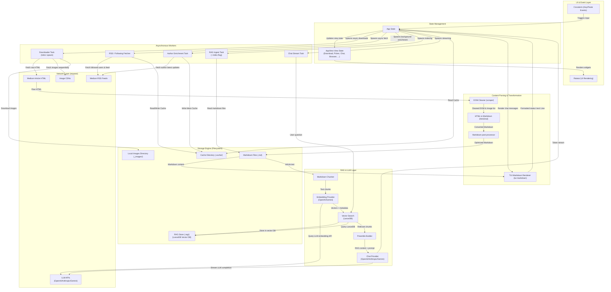
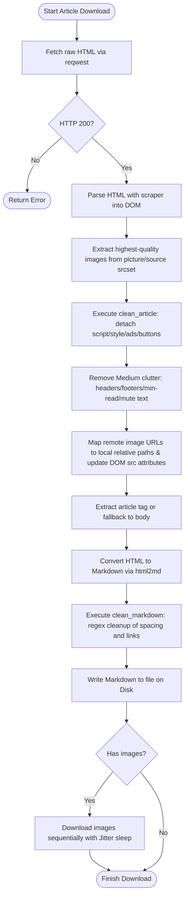
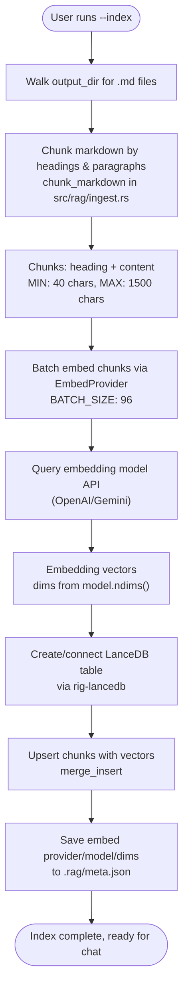
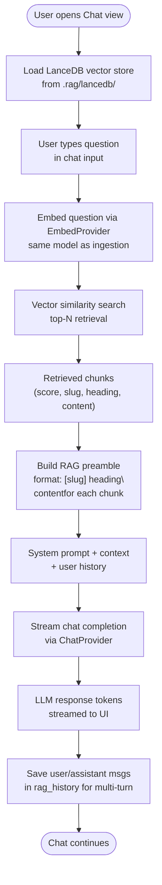
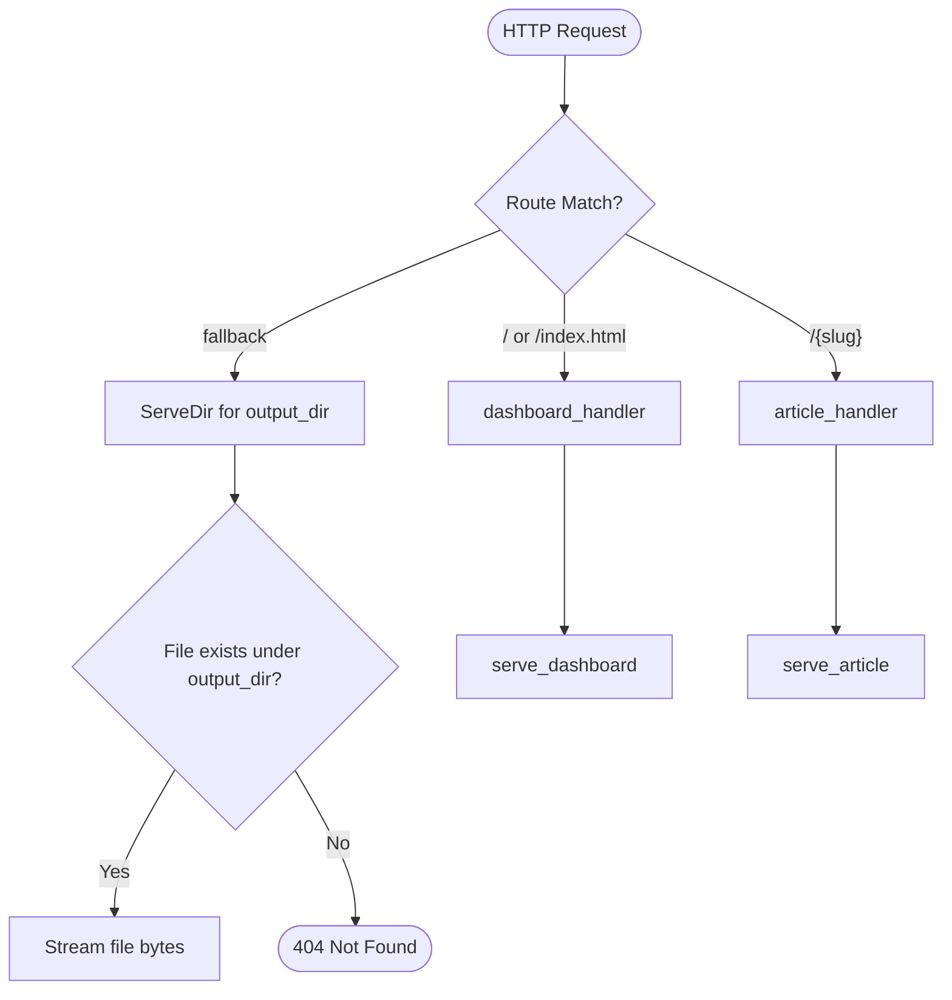

# System Architecture — med2md

`med2md` is an asynchronous Rust application that downloads Medium articles and converts them into clean, standalone Markdown files with locally saved images. It provides a Terminal User Interface (TUI) powered by `ratatui` and `crossterm`.

This document details the high-level architecture, component breakdown, and data flows of the system.

---

## 1. Core Architecture Diagram

The system is organized into decoupled layers: a **UI & State Layer** executing on the main thread, **Asynchronous Workers** communicating via message-passing channels, a **Parsing/Transformation Engine** that parses and cleans HTML DOM structures, a **Network Layer** that interacts with Medium APIs and RSS feeds, and a **Storage Engine** handling markdown outputs, media directories, and cached local assets.

```mermaid
graph TD
    subgraph UI ["UI & Event Layer"]
        crossterm["Crossterm (Key/Paste Events)"]
        ratatui["Ratatui (UI Rendering)"]
    end

    subgraph State ["State Management"]
        app["App State"]
        appview["AppView View State<br/>(Download, Picker, Chat, Browser, ...)"]
    end

    subgraph Async ["Asynchronous Workers"]
        downloader["Downloader Task (tokio::spawn)"]
        rss_fetcher["RSS / Following Fetcher"]
        enricher["Author Enrichment Task"]
        rag_ingest["RAG Ingest Task<br/>(--index flag)"]
        chat_stream["Chat Stream Task"]
    end

    subgraph Net ["Network Layer (reqwest)"]
        medium_rss["Medium RSS Feeds"]
        medium_html["Medium Article HTML"]
        cdn_images["Image CDNs"]
        llm_api["LLM APIs<br/>(OpenAI/Anthropic/Gemini)"]
    end

    subgraph Parser ["Content Parsing & Transformation"]
        html_cleaner["DOM Cleaner (scraper)"]
        converter["HTML to Markdown (html2md)"]
        md_cleaner["Markdown post-processor"]
        md_preview["TUI Markdown Renderer (tui-markdown)"]
    end

    subgraph RAG ["RAG & LLM Layer"]
        chunker["Markdown Chunker"]
        embedder["Embedding Provider<br/>(OpenAI/Gemini)"]
        retriever["Vector Search<br/>(LanceDB)"]
        chat_provider["Chat Provider<br/>(OpenAI/Anthropic/Gemini)"]
        preamble["Preamble Builder"]
    end

    subgraph Disk ["Storage Engine (Filesystem)"]
        md_output["Markdown Files (.md)"]
        img_output["Local Images Directory (_images/)"]
        cache_store["Cache Directory (.cache/)"]
        rag_store["RAG Store (.rag/)<br/>(LanceDB Vector DB)"]
    end

    crossterm -->|Triggers input| app
    app -->|Updates view state| appview
    appview -->|Renders widgets| ratatui

    app -->|Spawns async downloads| downloader
    app -->|Spawns async fetch| rss_fetcher
    app -->|Spawns background enrichment| enricher
    app -->|Spawns indexing| rag_ingest
    app -->|Spawns streaming| chat_stream

    rss_fetcher -->|Fetch followed users & feed| medium_rss
    downloader -->|Fetch raw HTML| medium_html
    downloader -->|Fetch images sequentially| cdn_images
    enricher -->|Fetch author latest updates| medium_rss

    medium_html -->|Raw HTML| html_cleaner
    html_cleaner -->|Cleaned DOM & Image list| converter
    converter -->|Converted Markdown| md_cleaner
    md_cleaner -->|Optimized Markdown| md_output
    md_output -->|Markdown content| md_preview
    md_preview -->|Formatted ratatui::text::Line| app
    downloader -->|Download images| img_output

    rss_fetcher -->|Read/Write Cache| cache_store
    enricher -->|Write Meta Cache| cache_store
    app -->|Read Cache| cache_store

    rag_ingest -->|Read markdown files| md_output
    md_output -->|Article text| chunker
    chunker -->|Text chunks| embedder
    embedder -->|Query LLM embedding API| llm_api
    embedder -->|Vectors + metadata| retriever
    retriever -->|Store in vector DB| rag_store

    chat_stream -->|User question| retriever
    retriever -->|Query LanceDB| rag_store
    retriever -->|Relevant chunks| preamble
    preamble -->|RAG context + prompt| chat_provider
    chat_provider -->|Stream LLM completion| llm_api
    chat_provider -->|Token stream| app
    app -->|Render chat messages| md_preview
```

---

## 2. Article Parsing and Cleaning Pipeline

Medium articles contain substantial amounts of tracking query parameters, navigation links, subscription banners, and interactive elements (like scripts, buttons, and mute options). `med2md` cleans these out in a structured pipeline before translating the HTML elements to Markdown format.

```mermaid
flowchart TD
    start([Start Article Download]) --> fetch_html[Fetch raw HTML via reqwest]
    fetch_html --> check_status{HTTP 200?}
    check_status -- No --> error([Return Error])
    check_status -- Yes --> parse_dom[Parse HTML with scraper into DOM]

    parse_dom --> extract_images[Extract highest-quality images from picture/source srcset]
    extract_images --> clean_dom[Execute clean_article: detach script/style/ads/buttons]
    clean_dom --> remove_clutter[Remove Medium clutter: headers/footers/min-read/mute text]
    remove_clutter --> map_images[Map remote image URLs to local relative paths & update DOM src attributes]
    
    map_images --> parse_article[Extract article tag or fallback to body]
    parse_article --> to_md[Convert HTML to Markdown via html2md]
    to_md --> clean_md[Execute clean_markdown: regex cleanup of spacing and links]
    
    clean_md --> write_md[Write Markdown to file on Disk]
    write_md --> img_loop{Has images?}
    img_loop -- Yes --> download_imgs[Download images sequentially with Jitter sleep]
    download_imgs --> done([Finish Download])
    img_loop -- No --> done
```

---

## 3. RAG (Retrieval-Augmented Generation) Pipeline

The RAG system allows users to index their downloaded articles into a local vector database and ask semantic questions about them using LLM chat. The pipeline has two main phases: **Ingestion** (one-time, triggered by `--index` flag) and **Query** (triggered by opening the Chat view with `Ctrl+G`).

### Ingestion Phase (`--index` flag)

```mermaid
flowchart TD
    start([User runs --index]) --> walk[Walk output_dir for .md files]
    walk --> chunk[Chunk markdown by headings & paragraphs<br/>chunk_markdown in src/rag/ingest.rs]
    chunk --> chunks["Chunks: heading + content<br/>MIN: 40 chars, MAX: 1500 chars"]
    
    chunks --> embed_batch[Batch embed chunks via EmbedProvider<br/>BATCH_SIZE: 96]
    embed_batch --> query_api["Query embedding model API<br/>(OpenAI/Gemini)"]
    query_api --> vectors["Embedding vectors<br/>dims from model.ndims()"]
    
    vectors --> build_index["Create/connect LanceDB table<br/>via rig-lancedb"]
    build_index --> upsert["Upsert chunks with vectors<br/>merge_insert"]
    upsert --> save_meta["Save embed provider/model/dims<br/>to .rag/meta.json"]
    save_meta --> done([Index complete, ready for chat])
```

### Query Phase (Ctrl+G in TUI)

```mermaid
flowchart TD
    start([User opens Chat view]) --> load_index["Load LanceDB vector store<br/>from .rag/lancedb/"]
    load_index --> user_q["User types question<br/>in chat input"]
    user_q --> embed_q["Embed question via EmbedProvider<br/>same model as ingestion"]
    embed_q --> search["Vector similarity search<br/>top-N retrieval"]
    search --> chunks["Retrieved chunks<br/>(score, slug, heading, content)"]
    
    chunks --> build_preamble["Build RAG preamble<br/>format: [slug] heading\\ncontentfor each chunk"]
    build_preamble --> preamble["System prompt + context<br/>+ user history"]
    preamble --> stream["Stream chat completion<br/>via ChatProvider"]
    stream --> response["LLM response tokens<br/>streamed to UI"]
    response --> save_msg["Save user/assistant msgs<br/>in rag_history for multi-turn"]
    save_msg --> done([Chat continues])
```

---

## 4. Component Breakdown

The codebase is modularized into discrete sub-modules under `src/` to separate TUI rendering, state control, network calls, HTML traversal, and disk persistence:

### A. State Management, UI & Event Handling
*   **[src/main.rs](src/main.rs)**: The application entry point. Parses command line arguments (including `--index`, `--chat-provider`, `--embed-provider`, etc.), initializes tracing instrumentation, sets up cookie authentication, and runs the terminal event loop.
*   **[src/app.rs](src/app.rs)**: Defines the central structures [App](src/app.rs#L60) (global application state), [AppView](src/app.rs#L30) (UI view variants: `Download`, `Picker`, `FeedSelector`, `AuthorBrowser`, `Loading`, `Browser`, `Chat`), and [AppEvent](src/app.rs#L51) (async channels communication event enumeration).
*   **[src/ui.rs](src/ui.rs)**: Renders TUI frames and subcomponents in [draw_ui](src/ui.rs#L78) using Ratatui layout splits, block borders, lists, and formatted paragraphs. Includes rendering for the new Chat view.
*   **[src/input.rs](src/input.rs)**: Listens for key events and triggers actions in [handle_key](src/input.rs#L277), cleans multi-line URL payloads via [handle_paste](src/input.rs#L128), and kicks off async download loops in [start_download](src/input.rs#L423). Includes `Ctrl+G` binding to open Chat view.

### B. Network, Authentication & API Harvesting
*   **[src/auth.rs](src/auth.rs)**: Implements [setup_cookies](src/auth.rs#L38) to read tokens from environment variables or query users interactively using `rpassword`, validating session integrity against Medium endpoints.
*   **[src/following.rs](src/following.rs)**: Retrieves followed writers and publications lists in [fetch_following_list](src/following.rs#L426) and crawls creators' RSS feeds to compile feed checklist details in [fetch_following_feed](src/following.rs#L41).
*   **[src/articles.rs](src/articles.rs)**: Queries user-specific author articles utilizing Medium API pagination limits and fallback RSS scraping.
*   **[src/feed.rs](src/feed.rs)**: Strips XSSI security wrappers from JSON responses, parses Apollo GraphQL states, and parses XML RSS feeds.
*   **[src/net.rs](src/net.rs)**: Defines common reqwest headers and manages sequential article downloading in [perform_download](src/net.rs#L33).
*   **[src/browser.rs](src/browser.rs)**: Drives the `AppView::Browser` interactive TUI browser in `run_browser_task`, dispatching each navigated URL to the landing-page/RSS/HTML-scrape strategy that best avoids Cloudflare gating, and streams incremental link updates back to the UI.

### C. Processing, Formatting & Storage
*   **[src/html.rs](src/html.rs)**: Houses the parsing and DOM cleaning routines including [clean_article](src/html.rs#L70) (element extraction, detach nodes) and [clean_article_and_collect_images](src/html.rs#L253) (srcset extraction, relative target path rewriting).
*   **[src/markdown.rs](src/markdown.rs)**: Formats local markdown files for the preview pane using `tui-markdown` in [render_markdown](src/markdown.rs#L8).
*   **[src/cache.rs](src/cache.rs)**: Reads and writes JSON-serialized records of authors, RSS feed items, and author metadata to the local cache directory under `<output_dir>/.cache`.
*   **[src/meta.rs](src/meta.rs)**: Coordinates asynchronous background author enrichment via [enrich_authors](src/meta.rs#L83) to fetch the latest post timestamps and post counts for all creators.
*   **[src/util.rs](src/util.rs)**: Implements common date formatting, slug sanitization, and jitter wait calculation.

### D. Local Reader Web Server & Repair Tooling
*   **[src/server.rs](src/server.rs)**: `--serve` entry point. A local HTTP server built using `axum` ([run_server](src/server.rs#L27)) that renders a browsable dashboard ([serve_dashboard](src/server.rs#L75)) and per-article reading view ([serve_article](src/server.rs#L195)) directly from the on-disk `.md` archive, with all frontend HTML/CSS/JS inlined as `const` templates. See §5 below.
*   **[src/checkmd.rs](src/checkmd.rs)**: `--checkmd` entry point. Walks `output_dir` and applies a fixed list of idempotent markdown repair functions ([run_checkmd](src/checkmd.rs#L18)) to already-downloaded files, e.g. fixing broken card links or setext-style title links, without requiring re-download.

### E. RAG, Embeddings & LLM Integration

*   **[src/llm_config.rs](src/llm_config.rs)**: Configuration resolution for chat and embedding providers. Reads CLI flags and environment variables (`OPENAI_API_KEY`, `ANTHROPIC_API_KEY`, `GEMINI_API_KEY`, `MED2MD_CHAT_PROVIDER`, etc.) and applies precedence: CLI > env var > default.
*   **[src/chat.rs](src/chat.rs)**: [ChatProvider](src/chat.rs) enum wrapping OpenAI/Anthropic/Gemini clients. Implements [stream_chat](src/chat.rs) to map provider-specific streaming responses into a unified `TokenStream` type (Pin<Box<dyn Stream<Item = ChatStreamEvent>>>).
*   **[src/embed.rs](src/embed.rs)**: [EmbedProvider](src/embed.rs) enum wrapping OpenAI/Gemini embedding models. Implements the `EmbeddingModel` trait to provide uniform interface for chunking/ingestion and query-time embedding.
*   **[src/rag/mod.rs](src/rag/mod.rs)**: Exports the `ingest`, `query`, and `schema` RAG submodules.
*   **[src/rag/schema.rs](src/rag/schema.rs)**: Defines [Chunk](src/rag/schema.rs) struct with `#[derive(Embed)]` macro, containing id, slug, source_path, heading, and embeddable content. Also defines Arrow/LanceDB schema creation and metadata (embed provider/model/dims) serialization.
*   **[src/rag/ingest.rs](src/rag/ingest.rs)**: Implements the indexing pipeline: walks markdown files, [chunk_markdown](src/rag/ingest.rs) splits by headings/paragraphs into chunks (40–1500 chars), batches embeddings via [EmbedProvider::embed_texts](src/rag/ingest.rs), and upserts chunks into LanceDB vector table.
*   **[src/rag/query.rs](src/rag/query.rs)**: Implements semantic retrieval via [retrieve](src/rag/query.rs) (LanceDB top-n similarity search) and [build_preamble](src/rag/query.rs) (formats retrieved chunks into a system prompt for the LLM to ground its response).

---

## 5. Local Reader Web Server

`--serve` starts a local HTTP server ([src/server.rs](src/server.rs)) built on top of `axum` and `tower-http` that lets users browse their downloaded article archive in a browser instead of the TUI. It uses `axum::Router` to route dashboard and article views, and leverages `tower_http::services::ServeDir` to securely serve static image assets located under the archive directory.

```mermaid
flowchart TD
    req([HTTP Request]) --> route{Route Match?}
    route -- "/ or /index.html" --> db_handler[dashboard_handler]
    route -- "/{slug}" --> art_handler[article_handler]
    route -- fallback --> serve_dir[ServeDir for output_dir]
    serve_dir --> img{File exists under output_dir?}
    img -- Yes --> serve_file[Stream file bytes]
    img -- No --> f404_2([404 Not Found])
    db_handler --> serve_db[serve_dashboard]
    art_handler --> serve_art[serve_article]
```

### Dashboard rendering ([serve_dashboard](src/server.rs#L75))
- Walks `output_dir` for `*.md` files, skipping known doc files (`README.md`, `ARCHITECTURE.md`, `PROJECT.md`, `PKG.md`, `AGENTS.md`, `CLAUDE.md`).
- Per file, extracts title/source URL from the leading `# [Title](url)` line, derives author from the URL host (`*.medium.com`) or `/@handle` path segment, estimates reading time from word count, and reads the file's `modified` timestamp via filesystem metadata.
- Sorts articles **newest-file-first** by mtime — a proxy for "date added to the local archive," since Medium's true publish date is discovered during RSS/API scraping (`src/articles.rs`) but is not currently persisted into the saved markdown.
- Renders one `article-card` per file into `DASHBOARD_HTML_TEMPLATE`: a single `const` HTML string with fully inlined CSS and vanilla JS — no build step, bundler, or JS framework.

### Article rendering ([serve_article](src/server.rs#L195))
- Reads the raw markdown file, JSON-encodes its contents, and injects it into `ARTICLE_HTML_TEMPLATE`, which renders the markdown client-side using the `marked` and `Prism.js` CDN scripts — the only external JS dependencies anywhere in the reader.

### Browser-side interactivity (the "cruft" — lives entirely in the served HTML, not the Rust binary)
- **Search** — filters `.article-card` elements client-side by substring match against title/author/description.
- **Compact view toggle** — clicking the "Total Articles" stat tile toggles a `.compact` CSS class on the grid for a denser, single-column layout; persisted across reloads via `localStorage`.
- **Author grouping** — clicking the "Authors" stat tile re-sorts and re-wraps `.article-card` DOM nodes into author-labeled sections (`.author-group-header`), restoring original document order when toggled off.
- **Per-card author filter** — clicking an author badge on a card populates the search box with that author's name and dispatches a synthetic `input` event, reusing the search filter path rather than a separate filter implementation.
- **Theme toggle** — light/dark mode via a `data-theme` attribute on `<html>`, persisted in `localStorage`.

Because every response is a fully self-contained page and the server is stateless between requests, all of the above is reconstructed from scratch (or restored from `localStorage`) on every navigation — there is no server round-trip for search, filtering, grouping, or theme.

---

## 6. Markdown Repair Tool (`checkmd`)

`--checkmd` (optionally combined with `--dry-run`) runs [run_checkmd](src/checkmd.rs#L18), which walks `output_dir` for `.md` files and applies a fixed, ordered list of idempotent repair functions ([Fixer](src/checkmd.rs#L6)) sourced from [src/html.rs](src/html.rs) — e.g. `fix_setext_title_link` and `fix_broken_card_links` — writing back only files where a fixer actually changed the content. It exists to patch articles downloaded before a markdown-cleaning bug fix, without requiring a full re-download from Medium.

---

## 7. Key Architectural Choices

1.  **Asynchronous Background Concurrency**: Heavy-weight IO operations (such as scraping, RSS fetching, author enrichment, and HTTP downloading) are offloaded to tokio threads via `tokio::spawn`. This prevents blockages in TUI rendering or user key processing.
2.  **Sequential Downloads with Jitter**: To protect the user's IP address and session from security challenges and rate-limiting from Cloudflare/Medium, downloads are executed sequentially rather than in parallel, separated by jittered delay periods.
3.  **Apollo GraphQL Harvesting**: Instead of relying purely on unstable HTML scraping structures, `med2md` parses the JSON Apollo State initialized within script tags in Medium's homepage, enabling stable retrieval of followed author details.
4.  **Author Enrichment and Cache Synchronization**: The background enrichment worker (defined in [src/meta.rs](src/meta.rs)) queries each author's latest post RSS timestamp and total posts. It caches them locally (`.cache/`) to avoid heavy startup fetches, enabling instantaneous reloading.
5.  **Formatted Markdown Rendering**: Swapped raw text viewing in the file picker preview pane for a fully formatted rendered layout using `tui-markdown` to provide a premium viewing experience directly within the terminal interface.
6.  **Provider Enum Dispatch for LLM Abstraction**: Rather than attempting to make `Agent<M>` and `CompletionModel` types themselves `dyn`-compatible (which violates Rust's trait object safety rules due to RPITIT generics), the architecture uses enum dispatch over concrete provider clients (`ChatProvider::OpenAI`, `Anthropic`, `Gemini`). Stream items are boxed only at the output boundary (`TokenStream`), erasing type information only at the point of consumption in the UI.
7.  **Provider-Agnostic Embedding Interface**: The `EmbedProvider` enum implements the `rig_core::EmbeddingModel` trait, allowing ingestion and query code to remain agnostic to the concrete embedding provider. The vector dimension is queried at runtime via `model.ndims()`, eliminating the need for hardcoded dimension constants.
8.  **Independent Embedding & Chat Provider Selection**: Embedding provider/model is configured separately from chat provider/model (e.g., can use OpenAI embeddings with Anthropic chat). This maximizes flexibility since Anthropic offers no embeddings API, while OpenAI, Gemini, and Anthropic all offer chat completions.
9.  **Axum-Based Local HTTP Server**: The `--serve` reader ([src/server.rs](src/server.rs)) is built on top of `axum` and `tower-http` rather than a hand-rolled TCP parser. This improves reliability, HTTP compliance, and security (by leveraging `tower-http`'s directory traversal protection for serving images) while keeping the implementation clean and focused. All rendering logic — including client-side search, view toggles, and theming — is still pushed into inlined HTML/CSS/JS `const` templates to keep the server itself a thin file-to-HTML mapper with no templating engine dependency.
