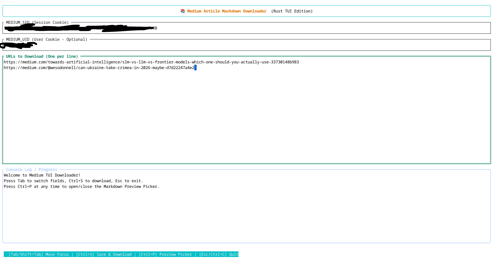
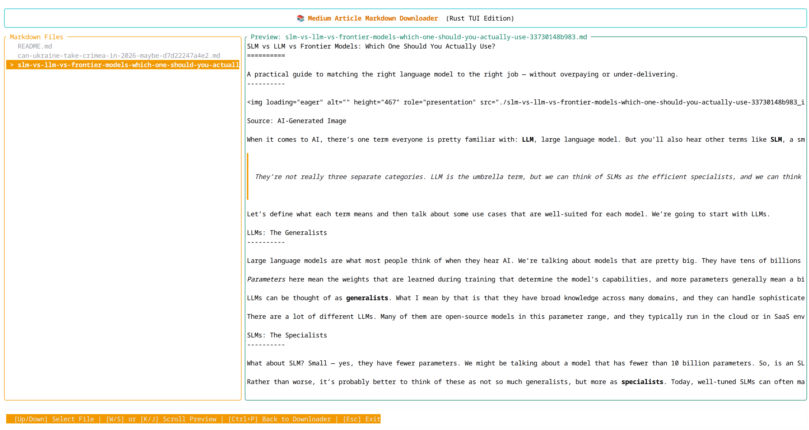

# med2md

A terminal user interface (TUI) application written in Rust for downloading Medium articles and converting them into clean Markdown files, along with all associated images downloaded locally.It features subscriber-only article support (by providing session cookies) and a built-in Markdown previewer directly in your terminal.

---

## Features

- 🖥️ **Interactive TUI**: Built using **Ratatui** and **Crossterm** for a smooth terminal experience.
- 🔓 **Member/Subscriber Article Bypass**: Input your Medium `sid` and `uid` session cookies to fetch subscriber-only articles you have access to.
- 🧹 **Clean Markdown Extraction**:
  - Automatically strips advertisements, social share buttons, SVGs, script tags, styling, and upgrade overlays.
  - Cleans query tracking parameters (like `source`, `referrer`, and `gi`) from links.
  - Converts HTML elements to standard Markdown using `html2md`.
- 🖼️ **Local Image Downloader**:
  - Scrapes and downloads all high-resolution images in the article.
  - Saves images to a folder named `<article-slug>_images/`.
  - Automatically rewrites Markdown image links to point to local relative paths.
- 📝 **Built-in Markdown Previewer**:
  - Open a list of downloaded Markdown files inside the TUI.
  - Preview formatted text (including code blocks and bold/italic elements) directly in the terminal.
- 📋 **Paste Support**: Seamlessly paste single or multiple URLs directly into the application.

---

## Getting Started

### Prerequisites

You must have the **Rust** toolchain installed. If you do not have it, install it via [rustup.rs](https://rustup.rs/):

```bash
curl --proto '=https' --tlsv1.2 -sSf https://sh.rustup.rs | sh
```

### Installation & Run

1. Clone or navigate to the repository directory.
2. Build and run the application:

```bash
cargo run --release
```

---

## How to Get Your Medium Session Cookies

To download articles that require a Medium subscription, you need to provide your session cookies:

1. Open your web browser and log into Medium.
2. Open **Developer Tools** (Press `F12` or right-click and select **Inspect**).
3. Navigate to the storage/cookies section:
   - **Chrome/Edge**: `Application` tab -> `Cookies` (on the left panel) -> `https://medium.com`
   - **Firefox**: `Storage` tab -> `Cookies` -> `https://medium.com`
4. Find the values for:
   - `sid`: The session ID cookie.
   - `uid`: The user ID cookie.
5. You can either paste these values directly into the TUI or export them as environment variables before starting the application:

```bash
export MEDIUM_SID="your-sid-value-here"
export MEDIUM_UID="your-uid-value-here"
cargo run --release
```

---

## Interface & Controls

### Main View (Downloader)



| Key / Control | Action |
| --- | --- |
| `Tab` | Focus next input field (`SID` ➔ `UID` ➔ `URLs`) |
| `Shift + Tab` (BackTab) | Focus previous input field |
| `Ctrl + S` | Start downloading the entered URLs |
| `Ctrl + P` | Toggle **Markdown Preview Picker** |
| `Ctrl + L` | Clear logs |
| `Esc` or `Ctrl + C` | Exit the application |

### Markdown Preview Picker View



Press `Ctrl + P` to toggle this view. It lists all `.md` files in the current folder.

| Key / Control | Action |
| --- | --- |
| `Up` / `Down` | Browse and select `.md` files |
| `PageUp` / `PageDown` | Scroll the Markdown preview content up or down |
| `w` / `s` or `k` / `j` | Alternative scroll controls for the preview content |
| `Ctrl + P` | Return to the Downloader view |

---

## Project Structure

- `src/main.rs`: The main application code containing the TUI layout, event loops, scrapers, clean-up logic, and image download pipeline.
- `Cargo.toml`: Package configuration and crate dependencies.
