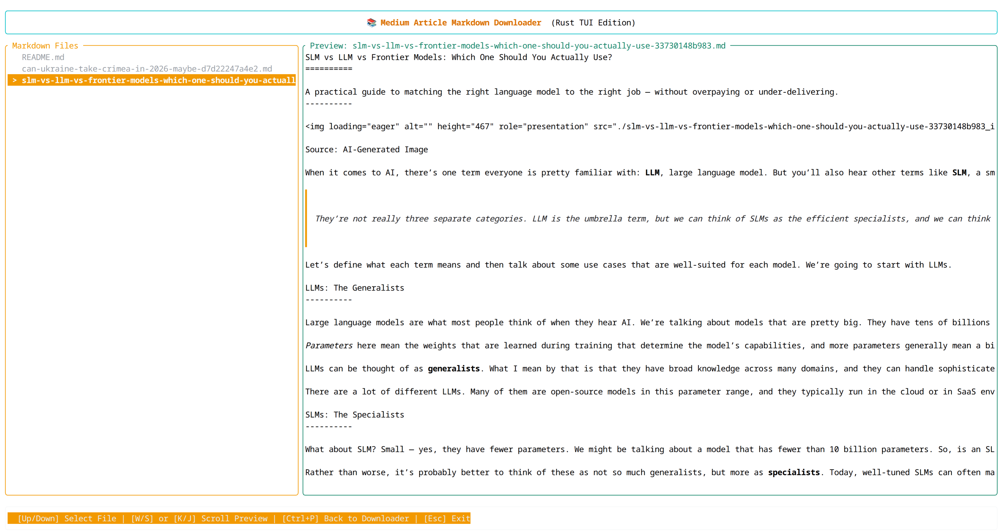
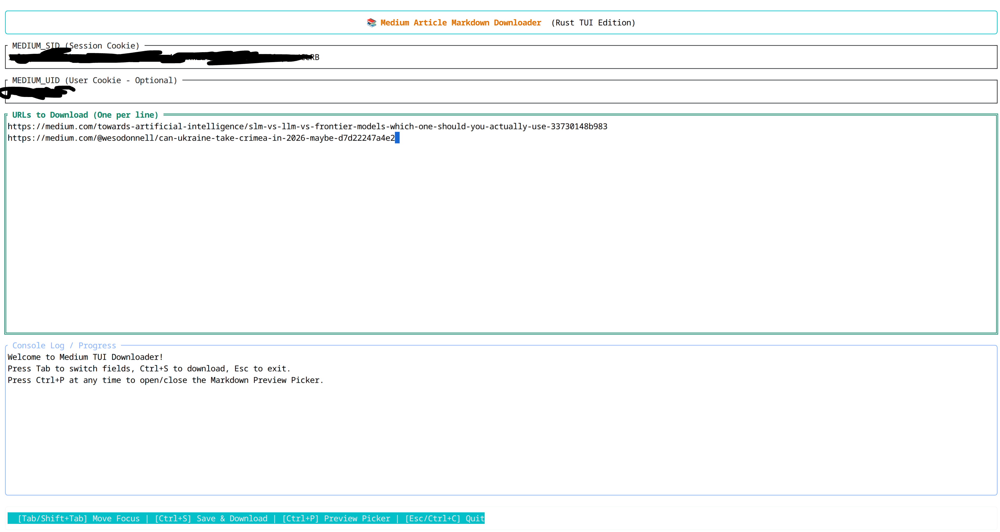

# med2md

A terminal UI for downloading Medium articles (including member-only content) as clean, offline-ready Markdown — with images saved locally and Medium's tracking/clutter stripped out.



## Features

- Download individual article URLs or bulk-select from your following feed
- Browse followed authors and fetch their recent articles
- Interactive TUI web browser for navigating Medium and multi-selecting articles to download
- Full-resolution images extracted and saved alongside each article
- Local JSON cache for authors/feeds to avoid redundant network calls
- In-app Markdown preview with syntax-aware rendering
- **Index downloaded articles and ask questions via RAG chat** — embed articles locally using OpenAI/Gemini, query with semantic search, and get answers grounded in your content using OpenAI/Anthropic/Gemini chat models



## Installation

Requires the Rust toolchain (edition 2024).

```sh
cargo build --release
./target/release/med2md
```

## Usage

```
med2md                    Launch TUI downloader
med2md --feed             Fetch your following feed and select articles to download
med2md --authors          Browse followed authors, select, then fetch their articles
med2md --dir <path>       Output directory for downloaded articles (default: ~/.local/med2md)
med2md --browse           Browse already-downloaded markdown files
med2md --force            Re-download articles even if they already exist
med2md --refresh          Ignore cache and re-fetch authors/feed from Medium
med2md --web              Launch TUI web browser to browse and select articles
med2md --log <path>       Write JSON logs to <path> (default: medium.log)
med2md --index            Index downloaded articles into the local RAG vector store, then exit
med2md --chat-provider <name>  LLM provider for chat (openai, anthropic, gemini; default: anthropic)
med2md --chat-model <name>     LLM model for chat (default: claude-sonnet-4-5)
med2md --embed-provider <name> Embedding provider (openai, gemini; default: openai)
med2md --embed-model <name>    Embedding model (default: text-embedding-3-small)
```

### In-app keybindings

- `Ctrl+G` — Open RAG chat interface (requires indexed articles)

### Environment variables

| Variable | Purpose |
| :--- | :--- |
| `MEDIUM_SID` | Session cookie, required for member-only content |
| `MEDIUM_UID` | User ID cookie, improves `--authors` completeness |
| `MEDIUM_USERNAME` | Your Medium `@username`, helps `--authors` discovery |
| `MEDIUM_CF_CLEARANCE` | Cloudflare clearance cookie, required for `--feed` and most content |
| `MEDIUM_DIR` | Output directory (default: `~/.local/med2md`) |
| `OPENAI_API_KEY` | OpenAI API key, required for OpenAI chat or embeddings |
| `ANTHROPIC_API_KEY` | Anthropic API key, required for Claude chat |
| `GEMINI_API_KEY` | Google Gemini API key, required for Gemini chat or embeddings |
| `MED2MD_CHAT_PROVIDER` | Default LLM provider for chat (openai, anthropic, gemini) |
| `MED2MD_CHAT_MODEL` | Default LLM model for chat |
| `MED2MD_EMBED_PROVIDER` | Default embedding provider (openai, gemini) |
| `MED2MD_EMBED_MODEL` | Default embedding model |

If unset, `med2md` will prompt interactively for Medium cookies on startup. LLM API keys are required and will not prompt — set them as environment variables or use CLI flags to override defaults.

## Quick Start: RAG Chat

```bash
# 1. Set up API keys
export OPENAI_API_KEY=sk-...
export ANTHROPIC_API_KEY=sk-ant-...

# 2. Download articles
./target/release/med2md --feed

# 3. Index them for RAG (one-time operation)
./target/release/med2md --index

# 4. Launch TUI and open chat with Ctrl+G to ask questions about your articles
./target/release/med2md
```

## Documentation

- [ARCHITECTURE.md](ARCHITECTURE.md) — system diagrams, async layers, and the article parsing pipeline
- [references/MEDIUM.md](references/MEDIUM.md) — how med2md authenticates with and scrapes Medium
- [references/rag-chat-plan.md](references/rag-chat-plan.md) — design spec for RAG chat integration, LLM provider abstraction, and vector database schema
- [PKG.md](PKG.md) — external crates and why each is used
- [PROJECT.md](PROJECT.md) — feature history and codebase evolution
- [AGENTS.md](AGENTS.md) — instructions for AI coding agents working in this repo
